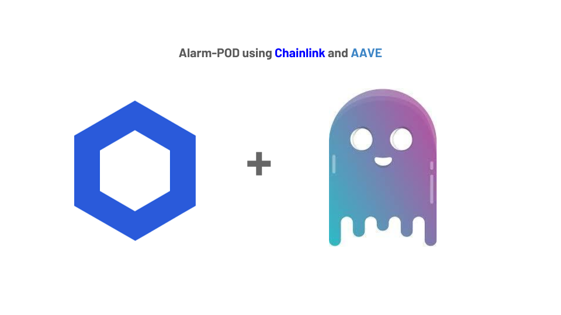
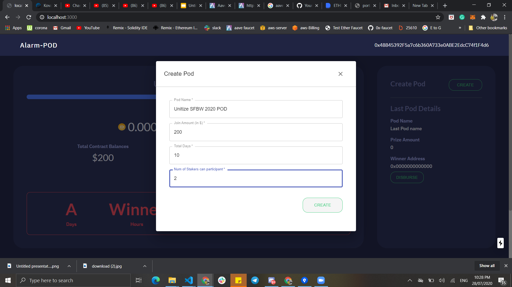
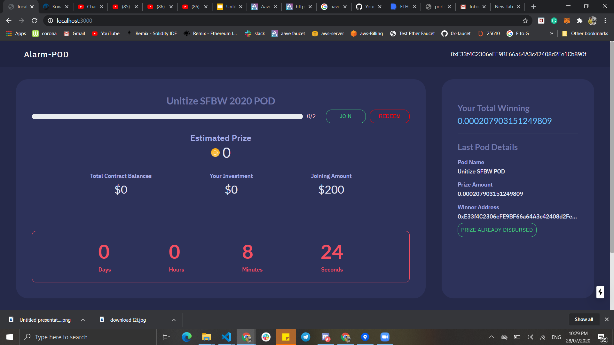
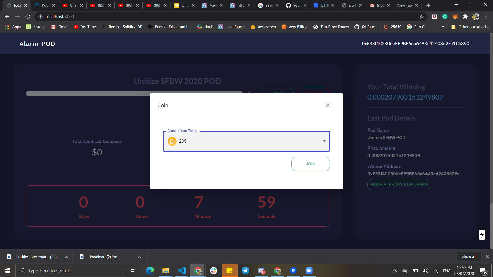
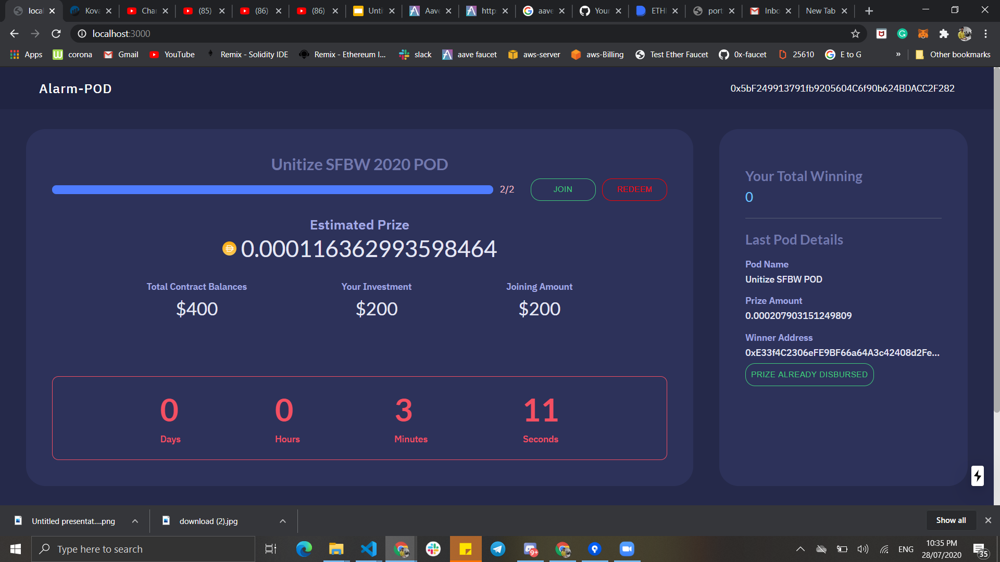
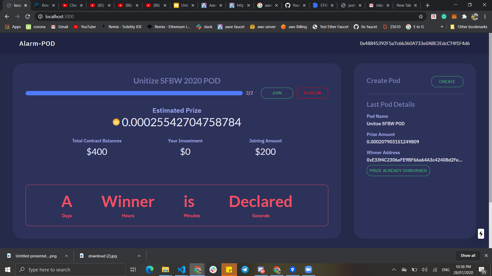
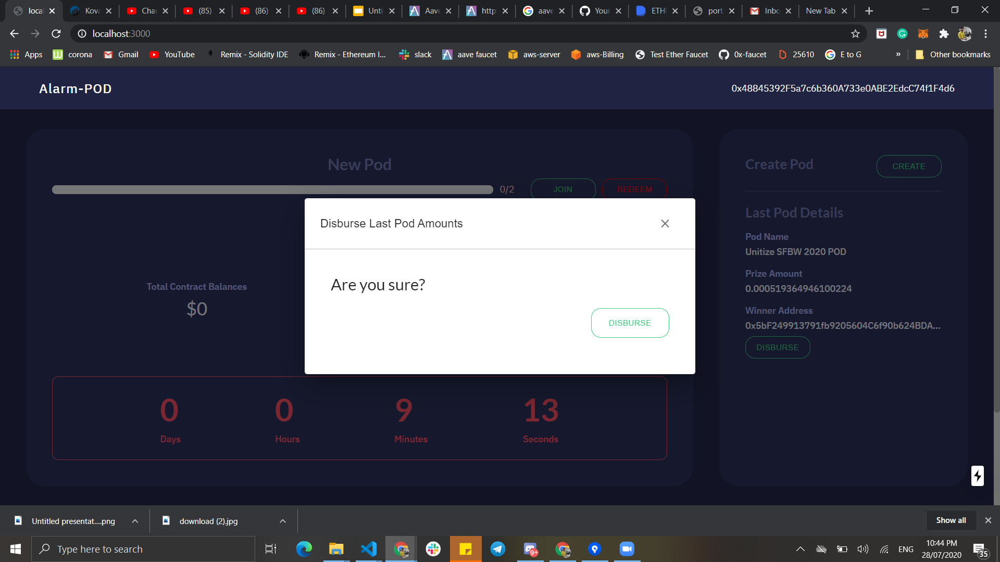
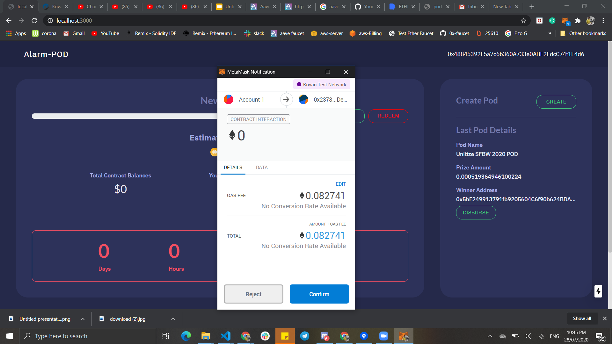
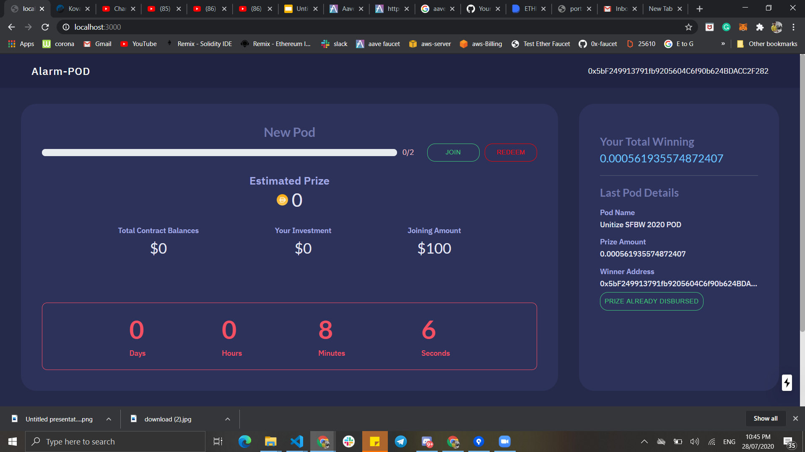

# Alarm-POD (Sponser Chainlink)

## Alarm-POD developed during Unitize-SFBW Hackathon By Gitcoin Community.

Alarm-POD is no-loss and crypto saving platform to win interest using trustless blockchain technology. Using chainlink alarm clock, chainlink VRF function and AAVE protocol

When Contract owner will create POD, it trigger the chainlink alarm clock to wait until to finish time-period.

During this time period it accures interest on deposited crypto token which is deposited by participants(staker).
And during this time period any one can see live interest generate on dashboard.

Once Time-period complete the chainlink-alarm-clock
recognize it. and then using callback function of chainlink-alarm-clock, it triggers the chainlink VRF function to get the winner among participant using randomness functionality of VRF.

once Chainlink VRF decide the winner, admin needs to disburse all the original tokens to all users and "original token + interest" to winner

Let's see demo below....

# Video Demo

https://youtu.be/cn7UgN33Ys8  

## How to run

1. Clone repo `https://github.com/sunnyRK/chainlinkExternal.git`
2. `cd chainlinkExternal` 
2. `npm install`
3. `node server.js`
4. Currently deployed on Kovan Network

## Screenhots

#### 1. Create POD by contract owner 

#### 2. You can see Pod is created and Chainlink Alarm clock is triggered and timer is running 

#### 3. One of the participant is joining the pod with DAI token 

#### 4. You can see in pod,
    - totalcontract balance generated from all of the paricipant
    - Your Investment from total pod balalnce
    - and Joining amount required to join in pod
    - And Even live interest is accuring from AAVE protocol

#### 5. After Chainlink alarm clock recognized that timer is finish, then chainlink VRF declared winner

#### 6. New pod is created and that old pod comes right side with winning and prize details. And COntract owner can disburse amount to all participant. 

#### 7. Disburse amount by contract owner 

#### 8. You can check winner total prize in right side top - "YOUR TOTAL WINNING" 

## Current Future Task in mind
1. Use ENS(Ethreum name service) to give more flexibilty to user.

## Tech stack

Ethereum   
Solidity   
Web3.js  
Chainink Decentralized Oracles  
    - Chainlink Alarm Clock - To wait for particular time-period to finish POD  
    - Chainlink VRF - To choose winner  
AAVE - To Earn interest  
Next.Js  
Semantic UI React